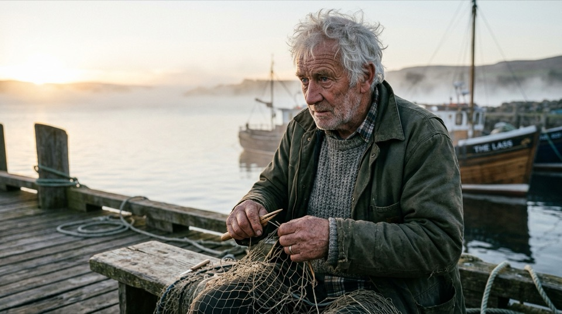

# GPT vs Gemini：4 个出图任务对比

同一份提示词原样分别发给 **Codex（`gpt-6.1-sol`）** 和 **Antigravity（`agy`，`gemini-3.8-flash-medium`）**，经 `model-bridge` 并行出图（2026-10-07，agy 1.3.1）。所有图都经脚本校验确为各家内置出图工具所生成（见 [usage.md](usage.md)）。

> 每格只跑了一次（n=1），差异里有随机成分，只作参考；图为缩到 960px 的 JPEG，原件 GPT 为 PNG、Gemini 为 JPEG。

## 1 · 黑板菜单（文字渲染）

<details><summary>提示词（两家原样相同）</summary>

> 一张复古咖啡馆木质黑板菜单的特写摄影：粉笔手写字，顶部标题是 MORNING BREW，下面三行菜单依次是“拿铁 Latte ¥28”“手冲 Pour Over ¥38”“可颂 Croissant ¥22”，右下角有一朵粉笔画的小雏菊。真实摄影，浅景深，暖色侧光，16:9 横幅。除上述文字外不要出现其他文字。

</details>

| GPT · gpt-6.1-sol（Codex） | Gemini · gemini-3.8-flash（agy） |
| --- | --- |
|  |  |
| 92 秒 · PNG | 53 秒 · JPEG |

**GPT**：标题、三行菜单、价格、右下雏菊都对，**只有第三行「可颂」被写成了繁体「頌」**（放大核对）；字形有粉笔质感。  
**Gemini**：标题、中英文、价格、雏菊**全部正确**，「颂」是简体；背景多了几个人物。  

**▸ 本题 Gemini 略优**

## 2 · 老渔夫修渔网（写实人像）

<details><summary>提示词（两家原样相同）</summary>

> 一位白发老渔夫清晨坐在码头上修补渔网的写实人像摄影：脸部皱纹与胡茬清晰可见，粗布外套的纤维质感，背景海面有薄雾，柔和侧逆光，85mm 镜头浅景深，16:9 横幅，无文字。

</details>

| GPT · gpt-6.1-sol（Codex） | Gemini · gemini-3.8-flash（agy） |
| --- | --- |
|  |  |
| 72 秒 · PNG | 85 秒 · JPEG |

**GPT**：皱纹、胡茬、粗布纤维、逆光边缘光和浅景深最到位，视线落在渔网上，**无文字**；色调偏浓。  
**Gemini**：更自然的电影感，但**船身出现「THE LASS」字样，违反「无文字」**；渔网稀疏，人物看向画外，外套更像防水夹克而不是粗布。  

**▸ 本题 GPT 更贴题**

## 3 · 书桌俯拍（计数与位置）

<details><summary>提示词（两家原样相同）</summary>

> 书桌俯拍的扁平插画：桌面上恰好有 3 只不同颜色的马克杯（红色、蓝色、黄色各一只）、2 本摊开的书、1 台银色笔记本电脑、1 盆绿色多肉植物、1 只趴着的橘猫；左上角有一盏亮着的台灯；所有物体互不重叠，数量必须准确，16:9 横幅，无文字。

</details>

| GPT · gpt-6.1-sol（Codex） | Gemini · gemini-3.8-flash（agy） |
| --- | --- |
|  |   |
| 119 秒 · PNG | 85 秒 · JPEG · 共 2 张 |

**GPT**：**一次全对**——3 只杯（红蓝黄）、2 本书、1 台笔记本、1 盆多肉、1 只猫、左上台灯，互不重叠。  
**Gemini**：第一张（左）**两本书重叠**，违反要求；它自己发现后**重新生成了第二张**（右），第二张全对（笔记本合着）。共产出 2 张，需要调用方挑最终稿。  

**▸ GPT 一次过；Gemini 要自我修正**

## 4 · 古寺改雪景（同一张参考图编辑）

<details><summary>提示词（两家原样相同）</summary>

> 保留构图与主体（石阶、钟楼、枫树与石灯笼的位置不变），改为大雪纷飞的冬日清晨：石阶和屋顶覆盖积雪，红叶换成挂雪的枯枝与少量残红，光线冷白柔和，其余不变。

</details>

参考图（两家都以它为输入）：


| GPT · gpt-6.1-sol（Codex） | Gemini · gemini-3.8-flash（agy） |
| --- | --- |
|  |  |
| 113 秒 · PNG | 75 秒 · JPEG |

**GPT**：大雪纷飞、积雪厚、残红保留，雪景效果最强；构图有放大和视角变化，但石阶、钟楼、枫树、石灯笼都在。  
**Gemini**：**构图更贴近原图**，但积雪偏薄、飘雪不明显，**左下角多出「Ruriko-in」字样**。  

**▸ 雪景效果 GPT 强；构图保持 Gemini 好**

## 小结（每格 n=1，只作参考）

- **GPT**：更稳——计数一次全对、「无文字」遵守得好、雪景和人像质感强；PNG 1672×941，72–119 秒。
- **Gemini**：更快（53–85 秒，JPEG 1376×768），中英混排文字渲染这次反而更准；但 4 张里有 2 张**多出了不该有的文字**，计数题第一张出错、靠自己重新生成才纠正。
- 要求「无文字」或要一次出准的图，先用 GPT；需要速度或文字排版时可以用 Gemini，但要人看一遍有没有多余文字。

## 复现

```bash
BRIDGE=skills/model-bridge/scripts/call.py
# 同一份提示词分别发给两家；t4 加 --image 传同一张参考图
python3 "$BRIDGE" run codex --task image --model gpt-6.1-sol --effort medium --prompt "$PROMPT"
python3 "$BRIDGE" run agy   --task image --model gemini-3.8-flash-medium    --prompt "$PROMPT"
```

提示词全文在上面各节的折叠块里。agy 的无头模式不是只读，行为与限制见 [usage.md](usage.md) 的「调 agy」。
